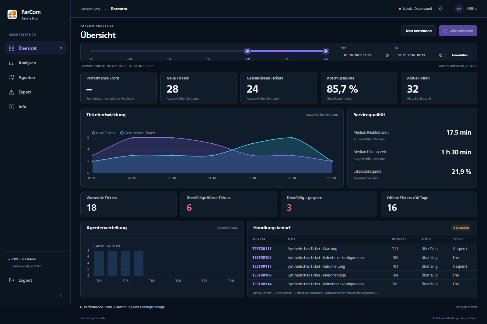
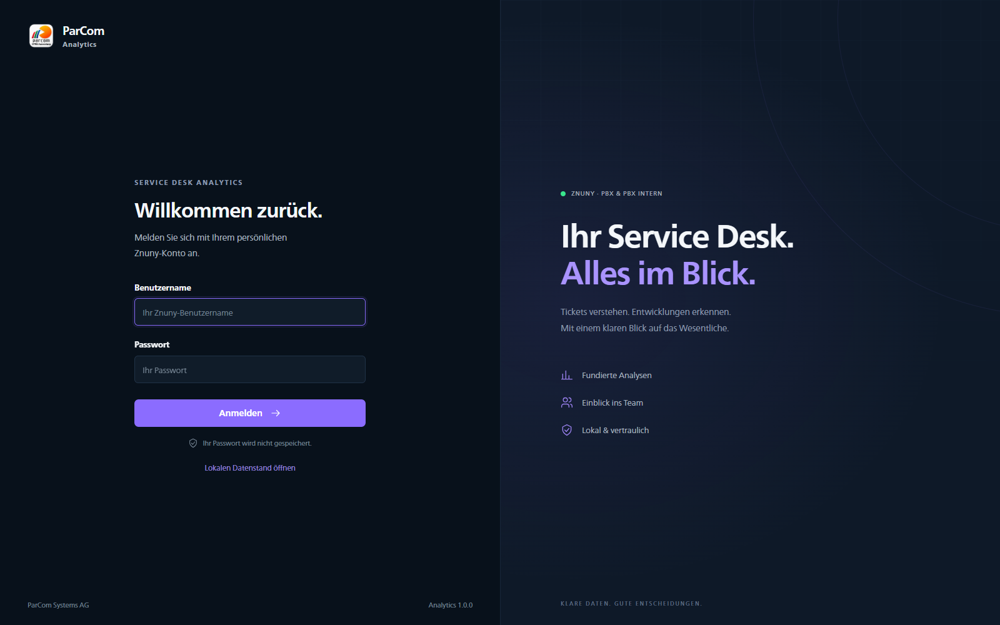
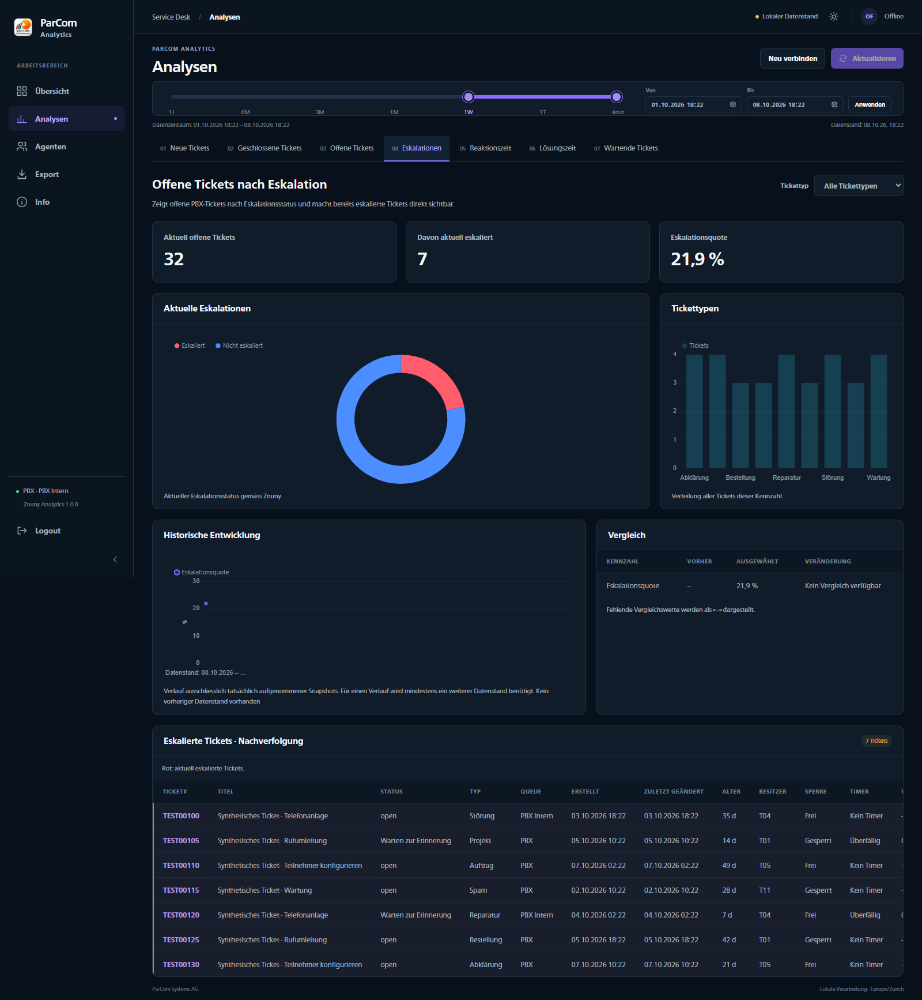
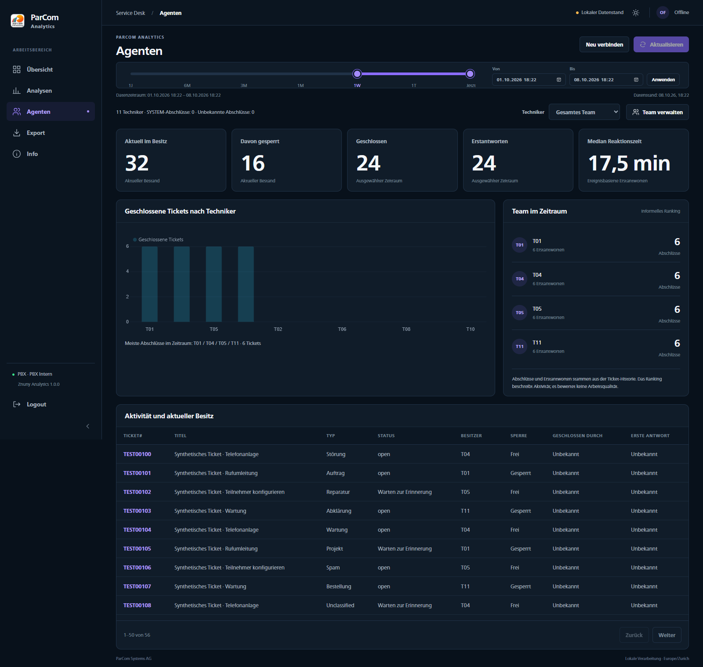
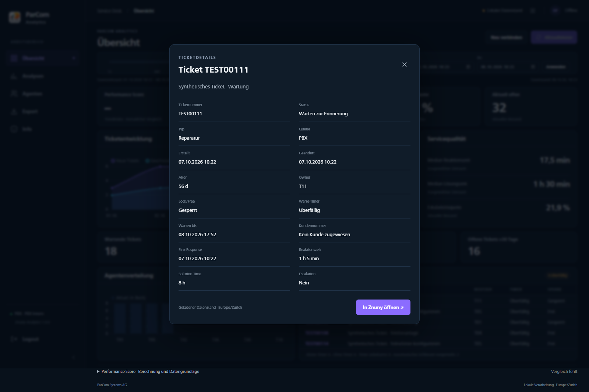
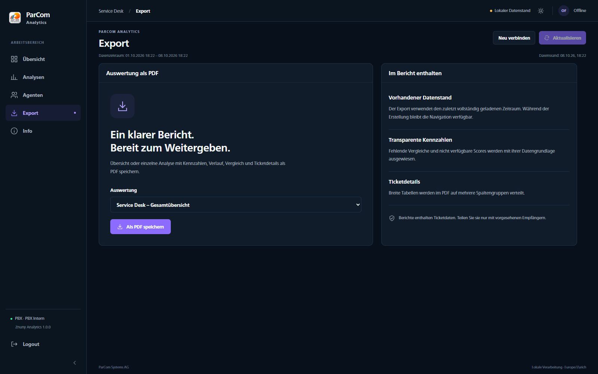
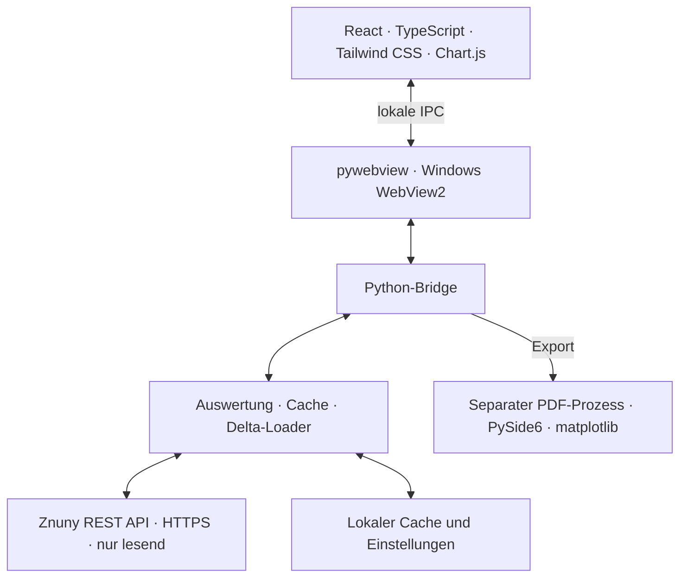

# ParCom Znuny Analytics

> Windows-Desktop-Anwendung für Znuny-Servicekennzahlen, Tickettrends und Agentenaktivität.




*Integriertes Produktionsfrontend mit anonymen, synthetischen Beispieldaten. Keine echten Kunden- oder Anmeldedaten. Der fehlende Monatsvergleich wird bewusst als «–» dargestellt.*

**Version 1.0.0 · Integrationsstand, noch keine Produktionsfreigabe.** EXE und Installer wurden auf dem Entwicklungsrechner geprüft. Die persönliche Znuny-Live-Abnahme, eine frische Windows-Installation und ein physischer DPI-Wechsel stehen noch aus. Daher sind Main-Merge, Tag und GitHub Release nicht freigegeben. Details: [VALIDATION.md](VALIDATION.md) und [INTEGRATION.md](INTEGRATION.md).

## Inhaltsverzeichnis

- [Überblick](#überblick)
- [Funktionen](#funktionen)
- [Screenshots](#screenshots)
- [Architektur](#architektur)
- [Performance](#performance)
- [Installation](#installation)
- [Bedienung](#bedienung)
- [Entwicklung](#entwicklung)
- [Build](#build)
- [Tests](#tests)
- [Datenspeicherung und Sicherheit](#datenspeicherung-und-sicherheit)
- [Projektstruktur](#projektstruktur)
- [Bekannte Einschränkungen](#bekannte-einschränkungen)
- [Drittkomponenten und Lizenz](#drittkomponenten-und-lizenz)
- [Version und Entwickler](#version-und-entwickler)

## Überblick

ParCom Znuny Analytics liest Tickets aus **PBX** und **PBX Intern** über die Znuny-REST-Schnittstelle. Die lokale Windows-Anwendung verbindet ein React-Dashboard mit einem Python-Auswertungsbackend. Der Server wird nur lesend angesprochen; Tickets werden nicht verändert. Die normale Oberfläche verwendet Live-Daten und den letzten lokalen Cache, keinen Excel-Upload.

## Funktionen

| Bereich | Inhalt |
| --- | --- |
| Übersicht | Ticketvolumen, Abschlussquote, offener Bestand, Servicezeiten, Warte-Timer, Handlungsbedarf und transparenter Performance-Trendindex |
| Analysen | Sieben Auswertungen mit Kennzahlen, Diagrammen, Typfilter, Vergleichen und Detailtabellen |
| Agenten | Aktueller Besitz, gesperrte Tickets, historisch zugeordnete Abschlüsse und Erstantworten, Team- und Technikerwahl |
| Ticketdetails | Status, Typ, Queue, Zeitangaben, Besitzer, Sperre, Timer, Kunde und direkter Znuny-Link |
| Export | Einzelanalyse oder aggregierte Service-Desk-Übersicht als PDF |
| Info | Versionsinformationen, Datenschutz, helles/dunkles Design und reduzierte Bewegung |

Die sieben Analysen zeigen **neue Tickets**, **geschlossene Tickets**, **offene Tickets**, **aktuelle Eskalationen**, **Reaktionszeit**, **Lösungszeit** und **wartende Tickets**. Eskalationen werden unter anderem als Ringdiagramm mit einer Nachverfolgungstabelle dargestellt. Nullminuten bleiben in Zeitkennzahlen enthalten; fehlende Werte werden nicht als Null ausgegeben.

## Screenshots

Die Aufnahmen zeigen die tatsächlich implementierte React-Oberfläche bei 1600 px Breite. Sie wurden automatisiert in Edge mit kontrollierter IPC-Testanbindung aufgenommen. Alle Kennzahlen entstehen über die Python-Adapter aus synthetischen Daten; Technikerkennungen sind für diese Aufnahmen anonymisiert. Es handelt sich nicht um eine reale Znuny-Sitzung. Native WebView2-Starts und PDF-Exporte wurden separat geprüft.

### Login

Leere Anmeldefelder und Zugang zum vorhandenen lokalen Datenstand.



### Übersicht

Das grosse Bild oben zeigt die Übersicht mit Timeline, Ticketentwicklung, Servicezeiten und Handlungsbedarf.

### Analysen

Aktuell eskalierte Tickets mit Ringdiagramm, Vergleich und Detailtabelle.



### Agenten

Aktivitätskennzahlen und ereignisbasierte Abschlüsse. Das Ranking bewertet keine Arbeitsqualität.



### Ticketdetails

Detailansicht eines ausdrücklich synthetischen Tickets.



### Export

Auswahl der Übersicht oder einer Einzelanalyse für den PDF-Bericht.



## Architektur



Vite erzeugt die lokalen Frontend-Dateien. Ein auf Loopback beschränkter Asset-Server liefert sie an WebView2. Die React-Oberfläche ruft die Python-Bridge auf; sie enthält weder die REST-Zugangsdaten noch eine zweite Implementierung der KPI-Formeln. Diagramme im Dashboard verwenden Chart.js.

Das Python-Backend übernimmt Ticketnormalisierung, Zeiträume, Fachregeln, Agentenzuordnung und persistente Datenstände. Der REST-Ablauf besteht aus Anmeldung, serverseitigen TicketSearch-Auswahlen, begrenzten TicketGet-Anfragen und bei Bedarf TicketHistoryGet. Abmelden versucht, die Sitzung auf dem Server zu beenden.

Der WebView-Hauptprozess lädt **kein Qt**. Für PDF-Berichte startet die Bridge einen eigenen Prozess mit der bestehenden Qt-/matplotlib-Engine. PyInstaller liefert Host und PDF-Worker getrennt aus; die Build-Skripte bereinigen PATH, um fremde Qt-/ICU-DLLs auszuschliessen. Die alte PySide-Präsentation bleibt bis zur vollständigen Live-Abnahme als Rückfalloption im Quellcode erhalten.

## Performance

Der integrierte Backendstand verwendet wiederverwendete HTTP-Verbindungen, **höchstens vier gleichzeitige Anfragen**, Zusammenfassung doppelter Anfragen, Ticketcache und Delta-Refresh. Unveränderte Tickets werden wiederverwendet; notwendige serverseitige Auswahlsuchen bleiben erhalten. Ein fehlgeschlagener Refresh überschreibt weder den letzten erfolgreichen Datenstand noch den Synchronisationszeitpunkt.

Agentenhistorie wird beim Öffnen von **Agenten** nachgeladen und pro Ticketversion im Arbeitsspeicher wiederverwendet. Bis dahin steht «Historie noch nicht verfügbar» statt erfundener Nullwerte. Normale wiederholte Navigation löst keine vollständige REST-Neuladung aus.

**Synthetischer Benchmark**, 40 Tickets mit künstlich 20 ms Anfragelatenz; keine Produktionsmessung:

| Szenario | Vorher | Optimiert |
| --- | ---: | ---: |
| Erstladung | 1,870 s | 0,469 s |
| Unveränderter Refresh | 1,853 s | 0,207 s |
| Vier geänderte Tickets | 1,856 s | 0,230 s |

Reale Znuny-Zeiten sind noch nicht gemessen. Methodik und Grenzen: [PERFORMANCE.md](PERFORMANCE.md).

## Installation

Voraussetzungen für den geprüften Build sind **Windows x64** und die **Microsoft Edge WebView2 Evergreen Runtime**. Python und Node.js werden auf dem Zielrechner nicht benötigt. Falls WebView2 fehlt, stoppt der Installer mit einem deutschen Hinweis auf die [Microsoft-Downloadseite](https://developer.microsoft.com/microsoft-edge/webview2/).

Der lokal gebaute Installer liegt unter `dist/release/ParCom_Znuny_Analytics_Setup_1.0.0.exe`; daneben liegt `SHA256SUMS.txt`. Es gibt noch keinen freigegebenen GitHub-Release-Download. **Ein Push veröffentlicht keinen Installer.**

Der Assistent bietet ein wählbares Installationsverzeichnis, Installation für den aktuellen oder alle Benutzer, Startmenüeinträge und eine optionale Desktop-Verknüpfung. Alle-Benutzer-Installation benötigt Administratorrechte. Herausgeber ist **Nico Köchli**; das Paket ist nicht digital signiert.

Deinstallation erfolgt über Windows **Installierte Apps**. Lokale Anwendungsdaten bleiben erhalten. Upgrades ersetzen verwaltete Laufzeitdateien und entfernen die alte EXE. Installation, Wiederinstallation und Deinstallation wurden mit identischem Paketinhalt unter einer separaten Testkennung geprüft; die bestehende Benutzerinstallation wurde dabei nicht verändert.

**Ohne Installer testen:** Im vollständigen Ordner `dist/web/ParCom_Analytics_Web/` die Datei `ParCom Znuny Analytics.exe` starten. `_internal` und `pdf_worker` müssen daneben bleiben. Nur die EXE zu kopieren genügt nicht.

## Bedienung

1. Mit dem persönlichen Znuny-Konto anmelden. **Lokalen Datenstand öffnen** zeigt einen vorhandenen Cache ohne neue Serverabfrage.
2. In der Übersicht Zeitraum und Datenstand prüfen. Standard ist die letzte Woche.
3. Unter **Analysen** eine Kennzahl und gegebenenfalls einen Tickettyp auswählen.
4. Unter **Agenten** Team oder Techniker wählen. Historische Aktivitäten werden bei Bedarf geladen.
5. Über eine Ticketnummer die Details öffnen; **In Znuny öffnen** führt zum Ticket im Browser.
6. Unter **Export** Bericht wählen und im Speichern-Dialog als PDF sichern. **Logout** beendet die Sitzung.

### Zeitraum und Datenstand

Die Timeline bietet **1T / 1W / 1M / 3M / 6M / 1J**, zwei verschiebbare Grenzen und exakte Von-/Bis-Felder. Zulässig sind ein Tag bis ein Kalenderjahr ohne zukünftiges Ende; Anzeigezeitzone ist **Europe/Zurich**. Vordefinierte Zeiträume rücken beim Aktualisieren weiter, ein eigener Zeitraum bleibt fest.

Neue und geschlossene Tickets beziehen sich auf den gewählten Zeitraum. Offene, eskalierte und wartende Tickets zeigen den aktuellen Bestand. Rückwirkende Abfragen erzeugen keine historischen Bestände. Vergleichszeiträume sind gleich lang und unmittelbar vorgelagert.

Alle zwei Minuten prüft eine kleine Suche auf Änderungen. **Neuer Datenstand verfügbar** weist auf neue Daten hin; erst ein ausdrücklicher Refresh ersetzt den angezeigten Stand. Während Hintergrundanfragen bleiben Navigation und vorhandene Daten verfügbar.

### Fachliche Einordnung

Live-Eskalationen stammen aus der aktuellen serverseitigen Eskalationssuche. Wartende Tickets sind `pending reminder`; automatisch zu schliessende Tickets werden separat ausgewiesen. Aktive, fehlende und überfällige Timer werden unterschieden. Kundennummer `00325` erscheint als **Kein Kunde zugewiesen**. Historische Tickets mit Typ `Unclassified` bleiben enthalten.

Agentenabschlüsse stammen aus der Ticket-Historie; aktueller Besitzer und `ChangeBy` ersetzen diese Zuordnung nicht. Erstantworten verwenden passende Historienereignisse. Nicht eindeutig zuordenbare Aktivitäten bleiben unbekannt, SYSTEM erhält keine menschlichen Abschlüsse. Die Teamwahl ist persistent; eine Abwahl löscht keine Historie.

### Service Desk Performance

Der Score ist ein **Trendindex, keine SLA-Erfüllung**. 100 % bedeutet keine Verschlechterung gegenüber dem Vergleichsmonat; auch unverändert hoher Backlog kann 100 % ergeben. Neue und geschlossene Tickets dienen als Kontext ohne Score-Gewicht.

Fünf Bereiche zählen je 20 %: Backlog, Erstantwort-Eskalationsquote, mediane Reaktionszeit, mediane Lösungszeit und wartende Tickets. Backlog und wartende Tickets berücksichtigen Anzahl und Anteil über 30 Tage. Pro Teilkennzahl gilt: aktuell ≤ vorher ergibt 100 %, sonst `100 × vorher / aktuell`. Von 0 auf 0 ergibt 100 %, von 0 auf einen positiven Wert 0 %. Verbesserungen sind bei 100 % gedeckelt. Diese Erstantwort-Eskalationsformel ist von der allgemeinen Live-Eskalationsanalyse zu unterscheiden.

Erforderlich sind alle sieben Kennzahlen, vollständige aufeinanderfolgende Vergleichsmonate und tatsächlich erhobene gemeinsame Snapshot-Tage. Eine Wochenabfrage allein genügt nicht. Bei fehlender Historie oder unbestimmten Eingangswerten erscheint kein Score. Die aufklappbare Erklärung zeigt Berechnung, Teilbereiche und Datenbasis.

### PDF-Berichte

Einzelanalysen enthalten Kennzahlen, Diagramm, Vergleich und Ticketdetails mit dem gewählten Typfilter. Breite Tabellen werden auf lesbare Spaltengruppen verteilt. Die Management-Übersicht enthält Aggregate ohne Ticketnummern oder Titel. Zeitraum, Quelle, Datenstand und Erstellungszeitpunkt werden ausgewiesen.

## Entwicklung

Geprüfte Umgebung: Python **3.14.8**, pnpm **11.25.0**, Windows x64. Node.js wird nur für die Frontendentwicklung benötigt. Python-Pakete stehen in `requirements-web.txt` und `requirements-lock.txt`, Build-Abhängigkeiten in `requirements-build.txt`; Frontend-Versionen sind in `frontend/pnpm-lock.yaml` festgehalten.

```powershell
py -3.14 -m venv .venv314
.\.venv314\Scripts\python.exe -m pip install -r requirements-web.txt -r requirements-build.txt
pnpm --dir frontend install --frozen-lockfile
pnpm --dir frontend build
.\.venv314\Scripts\python.exe start_web.py
```

`start_web.py` ist der integrierte Desktop-Einstieg und benötigt die gebauten Frontend-Dateien. `start.py` startet ausschliesslich die beibehaltene alte PySide-Oberfläche. `pnpm --dir frontend dev` dient der Frontendarbeit; eine Browserseite allein besitzt keine native Python-Bridge und ersetzt keinen Desktop-Test.

## Build

Für den vollständigen Build ist zusätzlich Inno Setup mit `ISCC.exe` erforderlich (geprüft: Inno Setup 7.1.0).

```powershell
# Tests, Produktionsfrontend, zwei PyInstaller-Bundles und native Prüfungen
.\scripts\build_web.ps1

# Vollständige Kette einschliesslich Inno Setup und SHA256SUMS.txt
.\scripts\build_windows.ps1

# Bereits vorhandenes Bundle prüfen und erneut als Installer verpacken
.\scripts\build_windows.ps1 -SkipBuild
```

Ein anderer Compilerpfad kann über `-IsccPath` übergeben werden. `-SkipBuild` überspringt nicht die native Start-/PDF-Prüfung. Der reguläre Build benötigt keine separat installierte Qt-Laufzeit beim Endbenutzer und erzeugt keine GitHub-Veröffentlichung.

## Tests

```powershell
.\.venv314\Scripts\python.exe -m pytest -q -o cache_dir=.validation/cache --basetemp .validation/tests
pnpm --dir frontend test
pnpm --dir frontend build
.\.venv314\Scripts\python.exe scripts/web_test_data.py
pnpm --dir frontend test:e2e
.\scripts\check_web_bundle.ps1 -IncludePdf
```

Browserprüfungen verwenden den installierten Microsoft Edge. Sie decken Navigation, Anmeldung/Fehler, Timeline, Filter, Agenten, Details, Export und Cache-Verhalten bei 1920 und 1050 px sowie simulierten 125 % / 150 % ab. Der native Test prüft tatsächliches WebView2, lokale Assets, Python-Bridge, beide PDF-Flüsse und einen Qt-freien Hauptprozess ohne Python/Node auf PATH.

```powershell
# Installiert und deinstalliert eine isolierte Testkennung, bewahrt vorhandene Installation
.\scripts\check_installer.ps1

# Reproduzierbare, sichere README-Aufnahmen
.\.venv314\Scripts\python.exe scripts/web_test_data.py --screenshots
pnpm --dir frontend exec playwright test --config playwright.docs.config.mjs
```

Testdaten sind synthetisch. Aktuelle Ergebnisse und reale Abnahmegrenzen stehen in [VALIDATION.md](VALIDATION.md).

## Datenspeicherung und Sicherheit

Lokaler Speicher: `%LOCALAPPDATA%\ParCom\ZnunyAnalytics\`.

| Inhalt | Zweck |
| --- | --- |
| `live-cache.json` | Letzter erfolgreicher Ticketstand, Agentenaktivitäten und historische Aggregate |
| `settings.ini` | Darstellung und Agentenauswahl |
| `logs/app.log` | Rotierende technische Protokolle |
| `exports/` | Vorgeschlagener PDF-Speicherort |
| `data/`, `index.json` | Erhaltene Daten des früheren lokalen Imports |

Der Cache enthält Ticketdetails, Titel, Kundenkennungen und Agentenreferenzen. Es gibt keine zusätzliche lokale Verschlüsselung; der Speicher unterliegt den Windows-Benutzerrechten. Keine Telemetrie, externe Analysedienste oder zusätzliche Datenbank.

Passwort und Session-ID werden nicht persistent gespeichert oder protokolliert. Die Sitzung liegt im Python-Arbeitsspeicher; Abmelden und reguläres Schliessen versuchen `SessionDelete`. TLS-Prüfung bleibt aktiv, Windows-Zertifikate werden über `truststore` genutzt. Zugriffe erfolgen mit den persönlichen Znuny-Berechtigungen; unvollständige Suchergebnisse werden nicht als vollständiger Datenstand übernommen. Ticketlinks enthalten keine Session-ID. Die WebView-Navigation ist auf die lokalen Anwendungsassets begrenzt; Ticketlinks werden im externen Browser geöffnet.

**Echte Znuny-Exporte, Zugangsdaten und Kundendaten dürfen niemals auf GitHub eingecheckt werden.** PDF-Berichte und Cache-Dateien können sensible Inhalte enthalten.

## Projektstruktur

```text
frontend/                React, TypeScript, Chart.js, Styles und Browserprüfungen
parcom_analytics/
  web/                   WebView-Host, Python-Bridge, DTOs und PDF-Worker
  znuny.py               Lesender REST-Client
  live_data.py           Normalisierung und optimierter Loader
  live_cache.py          Persistenter Datenstand und abgeleitete Berichte
  agents.py              Ereignisbasierte Agentenzuordnung
  analytics.py           KPI-Berechnungen
  service_desk.py         Transparenter Performance-Trendindex
tests/                   Python-Fach-, REST-, Integrations- und PDF-Tests
assets/                  Logo und Windows-Icon
scripts/                 Build-, Prüf- und Screenshot-Hilfen
packaging/               Getrennte PyInstaller-Konfigurationen
installer/               Inno-Setup-Konfiguration
docs/screenshots/        Sichere Aufnahmen der integrierten Oberfläche
```

## Bekannte Einschränkungen

- Reale Znuny-Anmeldung, PBX-/PBX-Intern-Abgleich und reale REST-Zeitmessungen sind noch nicht abgenommen.
- Installation wurde auf dem Entwicklungsrechner unter separater Testkennung geprüft; frische Windows-Installation und All-Users-Abnahme stehen aus. Die fehlende WebView2-Laufzeit wurde simuliert, nicht vom Rechner entfernt.
- Browser-Skalierung ersetzt keinen physischen Windows-DPI-Wechsel.
- Ohne vollständige vergleichbare Monatsdaten gibt es keinen Performance Score. Historische Bestände können nicht nachträglich aus heutigen Tickets rekonstruiert werden.
- EXE und Installer sind unsigned; es gibt noch keinen finalen Release und keinen freigegebenen Main-Merge.

## Drittkomponenten und Lizenz

Die Anwendung verwendet Python, React, TypeScript, Vite, Tailwind CSS, Chart.js, pywebview/WebView2, requests, truststore, pandas, openpyxl, matplotlib und PySide6 für PDF-Berichte. PyInstaller und Inno Setup erstellen die Windows-Pakete; pytest, Vitest und Playwright prüfen sie. Die verbindlichen Paketstände stehen in den genannten Lock- und Requirements-Dateien. Für Drittkomponenten gelten deren eigene Lizenzbedingungen; sie erhalten durch dieses Projekt keine andere Lizenz.

Im Repository liegt derzeit keine eigene `LICENSE`-Datei vor. Damit wird keine Open-Source-Lizenz für Projektcode, Logo oder ParCom-Marken zugesagt. Lizenzfreigabe und vollständige Hinweise für eine externe Weitergabe sind vor einer öffentlichen Produktionsveröffentlichung zu klären. Die Oberfläche ist eigenständig implementiert; es wurde kein Mosaic-Template-Code übernommen.

## Version und Entwickler

**Version 1.0.0** · Entwickelt von **Nico Köchli** für **ParCom Systems AG**.
